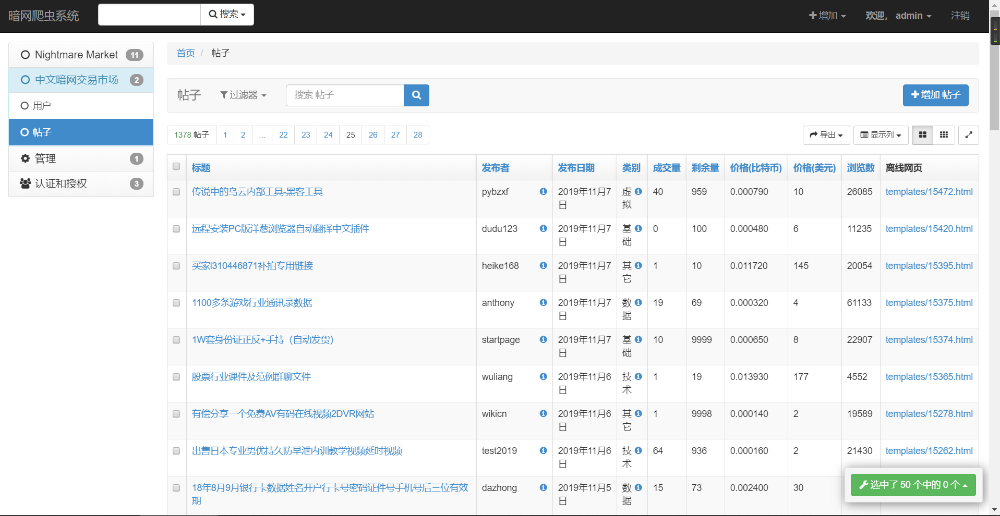
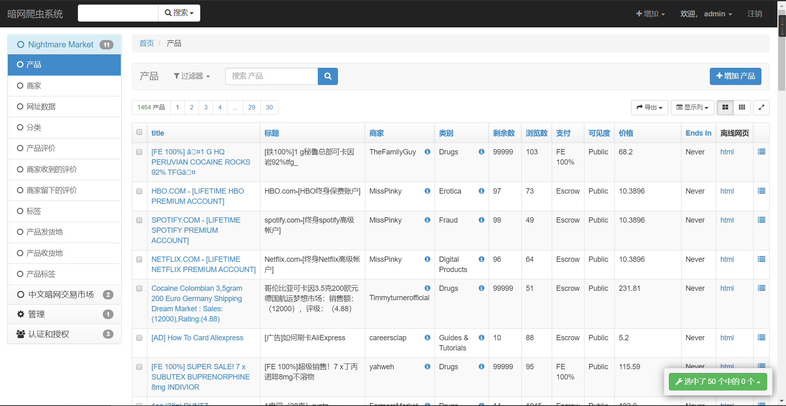

## 暗网爬虫, 及数据查看平台

### 安装项目
- `pip install -r requirement.txt`
- 配置TorProxy/torrc 科学上网
- 配置settings.py和marketWeb/settings.py

### 功能说明
1. 爬虫
  - 使用了selenium用于模拟浏览器操作从而登录载入链接
  - BeautifulSoup用于解析
  - requests用于离线下载资源文件
  - django用于数据库操作, 同时也方便数据查看
  - TorProxy负责打开关闭tor
  - 使用百度翻译接口对英文翻译
2. Django
  - 主页小组件: 使用pyecharts和xadmin
    - 
  - 详情页
    - 
    - 

### 文件说明
- `chinese_forum_spider.py`, `nightmare_spider.py`: 分别是俩个爬虫
- `runserver.py`: 运行Django
- `nightmare`, `post`: Django 应用
- `marketWeb`: Django 项目
- `TorProxy`: Tor 代理服务
- `utils`: 翻译
